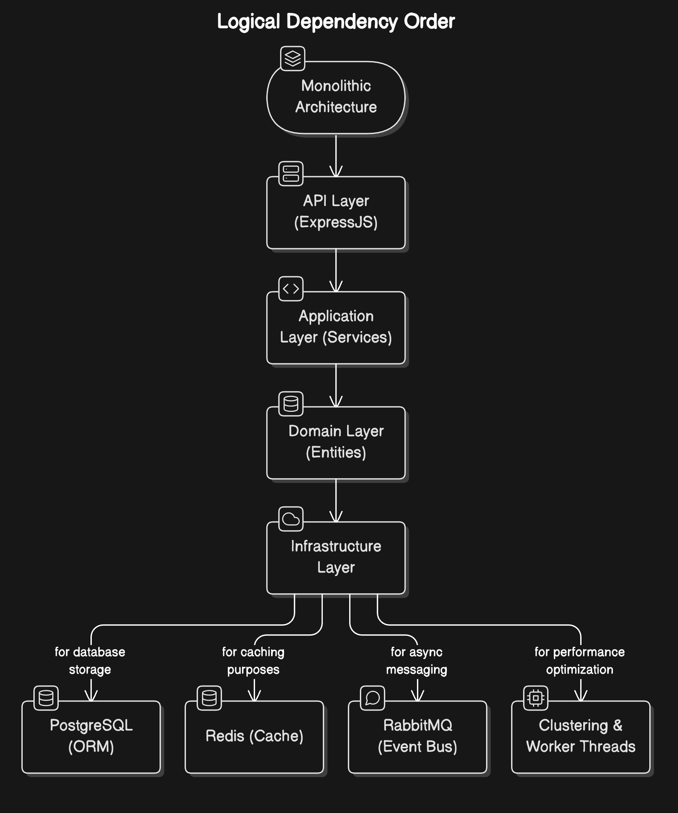
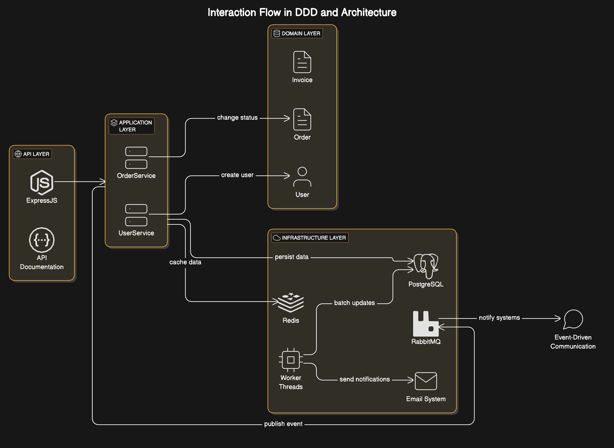

# Project Overview

##### This Node.js application is a monolithic architecture designed with extensibility and maintainability in mind. It uses TypeScript for strong typing and integrates several key technologies such as ExpressJS, PostgreSQL, Redis, REST API, clustering, and worker threads to ensure optimal performance. The application also applies multiple design patterns and software engineering principles to promote clean, maintainable, and testable code.

---

# 📖 Table of Contents

1. Features
2. Architecture Overview
3. Interaction Flow in DDD and Architecture
4. Domain-Driven Design Principles and Patterns
5. Design Patterns
6. Principles
7. Technologies
8. Getting Started
9. Project Structure
10. API Documentation
11. Running the Application
12. Running Tests
13. Usage
14. Contributing
15. License

---

# ✨ Features

## Order Management

* Order Retrieval
  * Fetches a paginated list of orders with filtering options
  * Uses Redis caching to optimize data retrieval
  * Implements proper error handling and validation
* Order Creation
  * Creates a new order with PENDING status
  * Associates the order with the current authenticated user
  * Publishes an event to notify admins about the new order
  * Implements proper validation and error handling
* Order Status Updates
  * Updates order status from PENDING to COMPLETED
  * Publishes an event to trigger invoice generation
  * Implements proper validation and error handling
  * Updates order status from PENDING to CANCELLED
  * Publishes an event to trigger invoice cancellation
  * Implements proper validation and error handling

## Invoice Management

* Invoice Generation
  * Handles invoice generation events from order status updates
  * Implements proper validation and error handling
  * Uses event-driven architecture for asynchronous processing
* Invoice Status Management
  * Updates invoice status (PAID, CANCELLED)
  * Implements proper validation and error handling
  * Uses event-driven architecture for status updates

## User Service
* User Management
  * Fetches a paginated list of users with filtering options
  * Retrieves users along with their assigned roles
  * Uses Redis caching for performance optimization
  * Implements proper validation and error handling
* User Operations
  * Creates new users with proper validation
  * Assigns default roles if none specified
  * Generates strong passwords
  * Updates user details with validation
  * Implements proper error handling
* Authentication & Authorization
  * JWT-based authentication
  * Role-based authorization
  * Session management
  * Password encryption and validation

## Event-Driven Architecture

* RabbitMQ Integration
  * Handles domain events asynchronously
  * Implements proper error handling
  * Uses typed events for type safety
* Event Types
  * ORDER_APPROVAL_STEP_UPDATE_ORDER_STATUS
  * ORDER_APPROVAL_STEP_INVOICE_GENERATE
  * ORDER_FAILED

## API Documentation

* Swagger UI Integration
  * OpenAPI 3.0 specification
  * Detailed endpoint documentation
  * Authentication scheme documentation
  * Request/Response schemas
  * Interactive API testing

---

# 🏗 Architecture Overview



---

#### This Node.js application follows a monolithic architecture that is modular and scalable. It uses the principles of Domain-Driven Design (DDD) to ensure that the codebase is well-organized and follows the business domain logic.

* Monolithic: While designed as a monolithic application, it's built with an architecture that supports easy splitting into microservices should the need arise.
* Modular: The application is divided into clear modules like orders, users, invoices, etc., each with its own responsibility. This makes it easy to extend the system with new features.
* Layered Architecture: It follows a typical layered architecture pattern, separating concerns into layers such as the API layer (controllers), service layer, data access layer (repositories), and domain layer (models).
* Asynchronous Processing: Worker threads and Redis are used for asynchronous processing, ensuring that long-running tasks don't block the main application flow.
* Event-Driven: The application utilizes RabbitMQ to handle domain events asynchronously, enabling decoupled communication between components.

---

# 🧩🔄⚙️🌐 Interaction Flow in DDD and Architecture



---

## 1. Domain Layer:

* The core domain logic is housed here, where entities like Order, User, and Invoice live. They represent the key concepts in the business domain.
* Operations like changing an order status or creating a user are encapsulated within these entities.

## 2. Application Layer:

* Services such as OrderService and UserService interact with domain entities to perform operations. They use repositories for data persistence.
* This layer uses patterns like Command and Observer to handle business logic and notify the system of changes.

## 3. Infrastructure Layer:

* Handles the technical details such as PostgreSQL, Redis, RabbitMQ, and email notifications.
* Redis is used to cache frequently accessed data, reducing load on the database.
* Worker threads handle tasks asynchronously.

## 4. API Layer:

* Exposes REST API endpoints to clients, interacting with the application layer to perform the required business logic.
* Uses ExpressJS and Swagger for routing and API documentation.

## 5. Event-Driven Communication:

* When a significant change occurs (like order approval or invoice generation), events are published to RabbitMQ to inform other systems or services.

---

# ⚙️ Domain-Driven Design Principles and Patterns

* REST API with ExpressJS & TypeScript
* PostgreSQL with ORM for database management
* Worker Threads to handle async processing
* Redis for caching and queue management
* Dependency Injection using typedi
* Microservices-ready architecture
* Event-driven system with RabbitMQ
* Robust Logging & Monitoring
* Unit & E2E Testing for reliability
* Security Best Practices
* Scalable & Maintainable Codebase
* Clustering for load balancing and high availability
* Domain-Driven Design Principles and Patterns

---

# 🧩⚙️🛠️📐 Design Patterns

##### The following design patterns have been implemented in the system to ensure modularity, flexibility, and scalability:

## 1. Singleton Pattern

* Used for: Managing service instances through `ContainerHelper`, authentication strategies in `AuthStrategiesInfrastructure`, and server instance in `ExpressServerInfrastructure`.
* Why: Ensures that only one instance of critical components is created throughout the application, reducing overhead and promoting reuse.

## 2. Factory Pattern

* Used for: Creating service instances in `ServerBootstrapper`, authentication strategies in `AuthStrategiesInfrastructure`, and task executors in `WorkerTaskHandler`.
* Why: Simplifies object creation and reduces tight coupling between components by centralizing object creation logic.

## 3. Dependency Injection (DI)

* Used for: Service registration and retrieval through `ContainerHelper`, service injection in `BaseController`, and throughout the application using TypeDI.
* Why: Decouples components and ensures that each class only knows about abstractions, not specific implementations, making testing and maintenance easier.

## 4. Observer Pattern

* Used for: Event handling through RabbitMQ subscribers (`OrderRabbitMQSubscriber`, `InvoiceRabbitMQSubscriber`, `NotificationRabbitMQSubscriber`).
* Why: Provides an efficient way to notify parts of the application about state changes and events.

## 5. Strategy Pattern

* Used for: Implementing different authentication strategies in `AuthStrategiesInfrastructure` through `BaseAuthStrategy` and `JwtAuthStrategy`.
* Why: Allows switching between different authentication methods without changing the core logic.

## 6. Command Pattern

* Used for: Handling different tasks in `WorkerTaskHandler` through `GenericTask` implementation.
* Why: Encapsulates requests as objects, allowing parameterization and decoupling of command execution.

## 7. Decorator Pattern

* Used for: Event publishing through `EventPublisherDecorator` and cache invalidation through `RedisCacheInvalidateDecorator`.
* Why: Allows adding new behavior (e.g., event publishing, cache management) without modifying existing code.

## 8. Repository Pattern

* Used for: Data access abstraction in various repository classes (`OrderRepository`, `InvoiceRepository`, etc.).
* Why: Helps decouple database logic from business logic, making it easier to change or optimize data access strategies.

## 9. Builder Pattern

* Used for: Building application components in `ServerBootstrapper` and building strategies in `AuthStrategiesInfrastructure`.
* Why: Provides a flexible solution for constructing complex objects step by step.

## 10. Publisher-Subscriber Pattern

* Used for: Domain event handling through RabbitMQ infrastructure and various subscribers.
* Why: Enables asynchronous communication between components through event publishing and handling.

---

# 📏🧭💡⚖️ Principles

##### This project follows key software design principles to ensure a robust and maintainable codebase:

## 1. SOLID Principles

* Single Responsibility Principle (SRP): Each class and module has a single responsibility, minimizing changes and complexity.
* Open/Closed Principle (OCP): Classes and modules are open for extension but closed for modification, enabling easier feature additions without breaking existing functionality.
* Liskov Substitution Principle (LSP): Derived classes can be used in place of their base classes without altering the correctness of the program.
* Interface Segregation Principle (ISP): Clients should not be forced to depend on interfaces they do not use. This helps in creating smaller, specialized interfaces.
* Dependency Inversion Principle (DIP): High-level modules should not depend on low-level modules. Both should depend on abstractions, which is achieved through DI.

## 2. DRY (Don't Repeat Yourself)

* The codebase ensures that redundant logic and code are minimized. Reusable components and functions are created for common tasks such as error handling, logging, and validation.

## 3. KISS (Keep It Simple, Stupid)

* The application follows a simple and clear architecture, avoiding unnecessary complexity in both the design and implementation. We favor simplicity and readability.

## 4. YAGNI (You Aren't Gonna Need It)

* Only essential features and functionality are implemented. The project avoids overengineering, focusing on the current requirements.

## 5. Separation of Concerns

* The project ensures that business logic, data access, and presentation are separated. Each module is responsible for a specific concern, promoting modularity and maintainability.

## 6. Composition Over Inheritance

* The project favors composing objects and reusing behavior through composition rather than relying heavily on inheritance.

---

# 🚀 Getting Started

## 1. Prerequisites

### For Docker Usage

* Install Docker Desktop and ensure it is running.

### For Application Usage

* Node.js (v23.x or higher)
* TypeScript
* PostgreSQL
* Redis
* RabbitMQ
* yarn

---

## Installation

## 1. Clone the repository:

```javascript
git clone git@github.com:yavarguliyev/invoices-hub.git
```

## 2. Set Up Environment: 

#### The Docker setup is located at {main_root}/deployment/dev. For managing containers, we do not use the docker-compose up -d command directly. Instead, we use specific scripts to handle the container lifecycle.

#### 1. To start the containers:

```javascript
bash start.sh
```

#### 2. To stop the containers:

```javascript
bash stop.sh
```

#### 3. To remove the containers, images, and volumes:

```javascript
bash remove.sh 
```

## Environment Configuration

* The .env file located in {main_root}/deployment/dev/.env is required for configuration.
* You can copy the example file (.env.example) to create your own .env file.

## Additional Setup (Optional)

#### If you need to perform additional tasks like database migrations before starting the application (e.g., before running yarn start), you will need to uncomment and adjust the following part in the docker-compose.yml file:

```javascript
services:
  # api:
  #   container_name: invoices_hub
  #   image: invoice_hub
  #   build:
  #     context: ../../
  #     dockerfile: Dockerfile
  #     args:
  #       ENV_PATH: ./deployment/dev/.env
  #   ports:
  #     - "3000:3000"
  #   env_file:
  #     - ./.env
  #   volumes:
  #     - ../../src:/app/src:delegated
  #   depends_on:
  #     - postgres
  #     - redis
  #     - rabbitmq
  #   restart: always
  #   command: sh -c "yarn mup && yarn start"
```

## 3. Install dependencies:

```javascript
yarn add
```

## 4. Run Migrations:

##### Run migrations:

```javascript
yarn mup
```

##### Revert migrations:

```javascript
yarn mdn
```

##### Copy the .env.example file to .env and fill in the appropriate values for your environment.

---

# 📂 Project Structure

```javascript
/dist                  # Compiled output of the TypeScript compilation process
/migrations            # Database migrations
/src
├── /api               # Contains controllers for different endpoints
├── /application       # Contains application-specific services or use cases
├── /core              # Contains the core logic of the application
├── /domain            # Contains domain models (entities) and related logic
├── /infrastructure    # Contains infrastructure-specific files
├── data-source.ts     # Data source configuration for migrations
├── index.ts.ts        # Main entry point of the application
/tests                 # Contains test files (unit and integration tests)
/types                 # This directory contains any custom type definitions
└── README.md
```

---

# 📚📄📝💻 API Documentation

#### API documentation is available at:

```javascript
http://localhost:3000/api-docs/#/
```

#### Swagger is used for API documentation, allowing developers to explore and test endpoints easily.

#### A Postman collection file is also included for testing API use cases:

```javascript
/postman/invoice_hub.postman_collection.json
```

# 🚀▶️💻 Running the Application

##### To start the application:

```javascript
yarn start
```

# 🧪✅🔍 Running Tests

##### To run tests, execute the following command:

```javascript
yarn test
```

# 💻⚙️ PM2 Commands

## View PM2 Status:

#### To check the status of your application running under PM2, use the following command:

```javascript
yarn pm2:status
```

## Clean and Restart PM2:

#### To stop all PM2 processes, clean up, and save the current process list:

```javascript
yarn pm2:clean
```

#### This will:

* Delete all PM2 processes.
* Save the PM2 process list.
* Display the updated status.

## Start the Application with PM2:

#### To start your application using the ecosystem.config.js file, run:

```javascript
yarn pm2:dev
```

#### This will launch the application in cluster mode, as defined in your PM2 configuration.

# 🏋️‍♂️ Load Testing

##### To check how many requests your application can handle, follow these steps:

## 1. Start the Application
#### Make sure the application is running before performing the load test:

```javascript
yarn start
```

## 2. Run the Load Test
#### Once the app is running, execute the following command:

```javascript
yarn loadtest:dev
```

### This will send 1,200 requests with 400 concurrent users to the healthcheck endpoint.

## Command Breakdown:

* -n 1200: Total number of requests.
* -c 400: Number of concurrent users.
* -k: Enables keep-alive to reuse TCP connections.

# 📊 Interpreting the Results

#### After the test, you'll see a summary of requests per second, response times, and possible failures. This helps assess the system's performance under heavy load.

---

# 🛠 Usage

## Example Operations

### 1. Create an Order

#### Endpoint: POST {{URL}}/api/v1/orders

```javascript
{
    "totalAmount": 180.20
}
```

---

# 🤝 Contributing

1. Fork the repository.
2. Create a new branch (git checkout -b feature-name).
3. Commit your changes (git commit -am 'Add new feature').
4. Push to the branch (git push origin feature-name).
5. Create a new Pull Request.

---

# 📝 License

#### This project is licensed under the MIT License. See the [LICENSE](https://github.com/yavarguliyev/invoices-hub/blob/master/LICENSE) file for details.

# 💻 Technologies

* Node.js: JavaScript runtime for building scalable, event-driven network applications
* ExpressJS: Minimalist web framework for Node.js that simplifies routing and middleware management
* TypeScript: A statically typed superset of JavaScript that enhances development with compile-time checks
* PostgreSQL: Robust relational database for structured data storage, ensuring reliability and ACID compliance
* Redis: High-performance, in-memory data structure store, used for caching and managing job queues
* RabbitMQ: Message broker for handling domain events and asynchronous communication
* MikroORM: TypeScript ORM for database operations with proper entity management
* TypeDI: A dependency injection library that promotes clean architecture
* Swagger: Tool for automatically generating RESTful API documentation
* Jest: Testing framework for unit and integration tests
* Passport.js: Authentication middleware for Node.js
* JWT: JSON Web Tokens for secure authentication
* DataLoader Implementation: Optimizes database queries by batching and caching requests, addressing the N+1 query problem and improving performance in high-volume environments
.